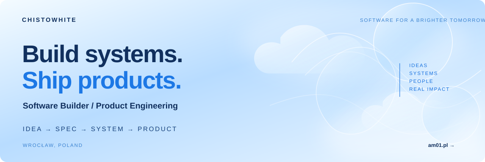

  

  <a href="https://www.am01.pl/">Website</a>
  ·
  <a href="https://www.linkedin.com/in/danil-drobnyi-58ab1a2ab/">LinkedIn</a>
  ·
  <a href="https://x.com/chsto0x">X</a>

<table width="100%">
  <tr>
    <td><h2>// ABOUT</h2></td>
    <td align="right">TURNING IDEAS INTO USEFUL SOFTWARE</td>
  </tr>
</table>

I build software with AI-first workflows.

My focus is turning ideas into working systems: understanding the problem, defining the structure, directing AI agents, verifying the result and shipping the product.

I am not tied to one language or framework. The goal is to understand systems well enough to build useful products across different stacks.

<table width="100%">
  <tr>
    <td><h2>// WHAT I BUILD</h2></td>
    <td align="right">IDEAS TO REAL PRODUCTS</td>
  </tr>
</table>

<table width="100%">
  <tr>
    <td width="25%" valign="top"><h3>🌐 Web applications</h3>
Interfaces, business logic, integrations and complete web products.
</td>
    <td width="25%" valign="top"><h3>▣ CRM systems</h3>
Customer workflows, dashboards and internal management tools.
</td>
    <td width="25%" valign="top"><h3>◈ Internal tools</h3>
Custom tools that solve real business problems and automate work.
</td>
    <td width="25%" valign="top"><h3>⚡ Business systems</h3>
From an idea and requirements to a working production system.
</td>
  </tr>
</table>

<table width="100%">
  <tr>
    <td><h2>// DEVELOPMENT MODEL</h2></td>
    <td align="right">A CLEAR PATH FROM IDEA TO IMPACT</td>
  </tr>
</table>

<table width="100%">
  <tr>
    <td align="center" valign="top" width="15%"><strong>Problem</strong> Understand the real need</td><td align="center" width="2%">→</td>
    <td align="center" valign="top" width="15%"><strong>Spec</strong> Define scope and structure</td><td align="center" width="2%">→</td>
    <td align="center" valign="top" width="18%"><strong>Architecture</strong> Design the system</td><td align="center" width="2%">→</td>
    <td align="center" valign="top" width="15%"><strong>AI agents</strong> Build with AI assistance</td><td align="center" width="2%">→</td>
    <td align="center" valign="top" width="15%"><strong>Verification</strong> Test and refine</td><td align="center" width="2%">→</td>
    <td align="center" valign="top" width="14%"><strong>Production</strong> Ship and create impact</td>
  </tr>
</table>

<table width="100%">
  <tr>
    <td><h2>// SELECTED WORK</h2></td>
    <td align="right">REAL PROJECTS. REAL PROBLEMS. REAL SOLUTIONS.</td>
  </tr>
</table>

<table width="100%">
  <tr>
    <td width="33%" valign="top">
      
      <h3><a href="https://github.com/chistowhite/File-Mover-Script">File-Mover-Script</a> Public</h3>
      
Move files from nested folders into one target directory.

      
🔹 Python &nbsp; 🟡 Automation &nbsp; 🔵 Tools

      <a href="https://github.com/chistowhite/File-Mover-Script">View repository →</a>
    </td>
    <td width="33%" valign="top">
      
      <h3><a href="https://github.com/chistowhite/Tea-chistowhite">Tea-chistowhite</a> Public</h3>
      
Tea brand website with a modern design and smooth UX.

      
🔸 HTML &nbsp; 🔹 CSS &nbsp; 🟡 JavaScript

      <a href="https://github.com/chistowhite/Tea-chistowhite">View repository →</a>
    </td>
    <td width="33%" valign="top">
      
      <h3><a href="https://github.com/chistowhite/nebulus">nebulus</a> Public</h3>
      
Virtual IPFS project and a playground for visual concepts.

      
🟣 Creative &nbsp; 🔵 Web &nbsp; 🟡 Design

      <a href="https://github.com/chistowhite/nebulus">View repository →</a>
    </td>
  </tr>
</table>

<table width="100%">
  <tr>
    <td><h2>// TECH &amp; TOOLS</h2></td>
    <td align="right">TOOLS CAN CHANGE. ENGINEERING PRINCIPLES REMAIN.</td>
  </tr>
</table>

<table width="100%">
  <tr>
    <td align="center"><strong>◉ Codex</strong></td><td align="center"><strong>◉ GitHub</strong></td><td align="center"><strong>◆ Figma</strong></td><td align="center"><strong>🐍 Python</strong></td><td align="center"><strong>JS JavaScript</strong></td><td align="center"><strong>••• More</strong> as needed</td>
  </tr>
</table>

<table width="100%">
  <tr>
    <td><h2>// CONTACT</h2></td>
    <td align="right">LET'S BUILD SOMETHING USEFUL.</td>
  </tr>
</table>

<table width="100%">
  <tr>
    <td width="42%" valign="top"><h3>Open to collaboration</h3>
I am interested in new opportunities, exciting projects and people who want to build useful things.
</td>
    <td align="center" valign="top"><a href="https://www.linkedin.com/in/danil-drobnyi-58ab1a2ab/"><strong>LinkedIn</strong> /in/danil-drobnyi-58ab1a2ab</a></td>
    <td align="center" valign="top"><a href="https://www.am01.pl/"><strong>Website</strong> am01.pl</a></td>
    <td align="center" valign="top"><a href="mailto:hello@am01.studio"><strong>Email</strong> hello@am01.studio</a></td>
  </tr>
</table>

Built in public · AI-native development · Product engineering

